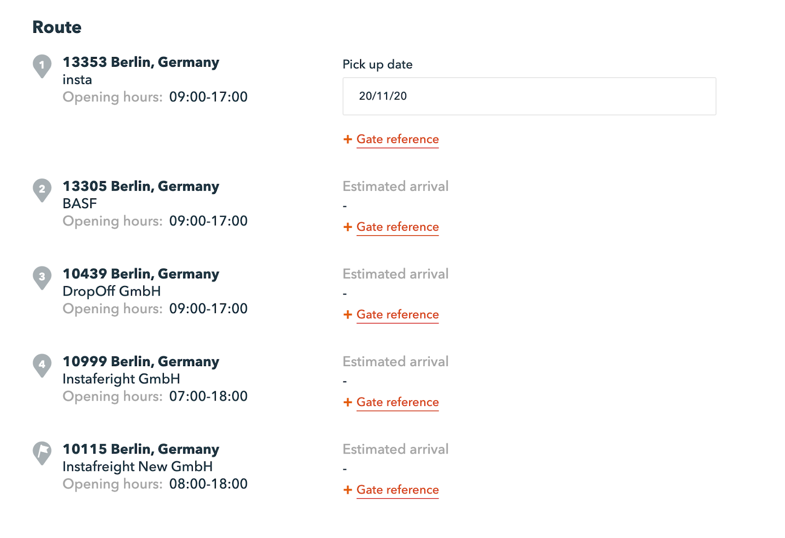
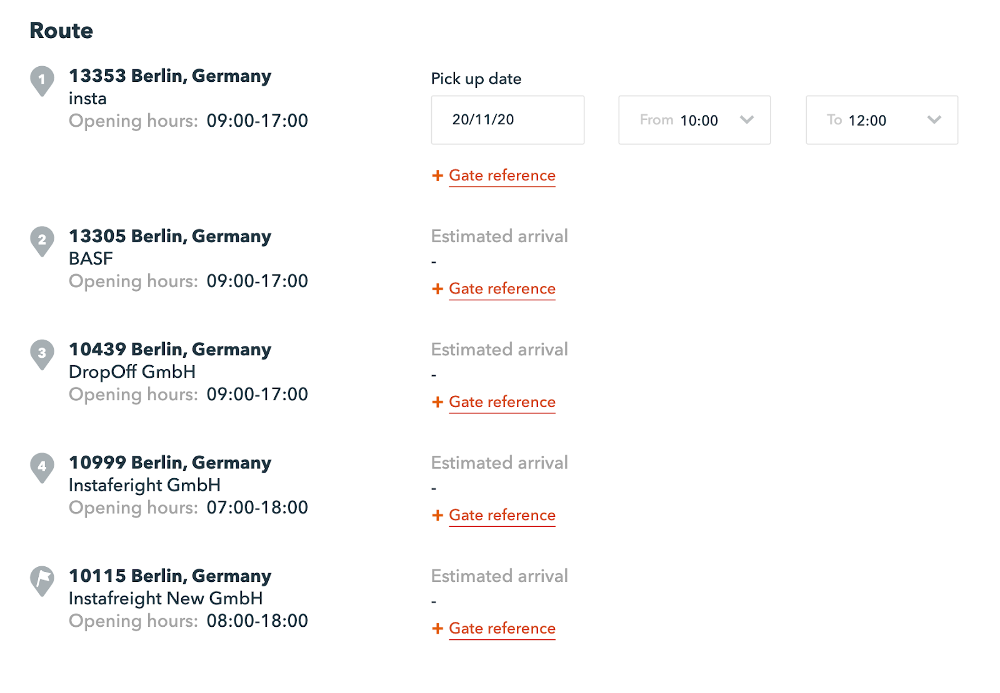
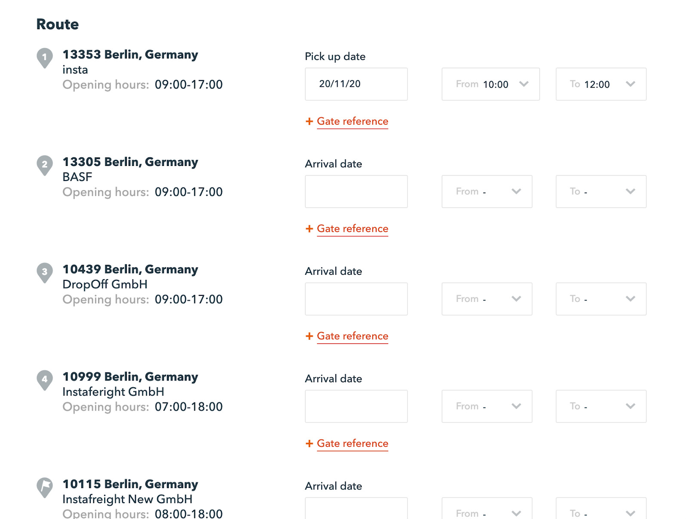
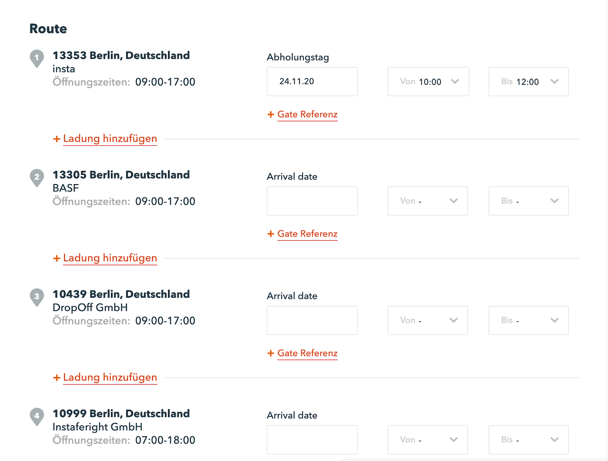
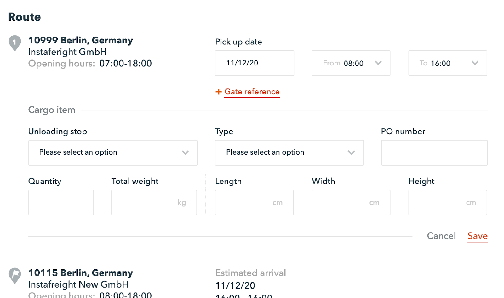

# Route Display Information

## Background

Stops are predefined and we propose a schedule to the user. Depending on the schedule strategy, users are able to override parts of it.

### Scheduling strategy

#### Fixed

Customers can select the date for the first stop when using the fixed scheduling strategy.

#### Semi Flexible

Customers can select the date and time for the first stop when using the semi flexible scheduling strategy.

#### Flexible

Customers can select the date and time for all the stops when using the flexible scheduling strategy.

.

### Cargo items

We allow some customers to add cargo items per stop. This flag can be combined with any scheduling strategy.

When a customer can add cargo items, an “Add cargo” button is shown below every stop.

Clicking on the button shows a form.

Cancelling closes the form. Saving is out of scope.

## Challenge

- The component should support the 3 scheduling strategies
- The component should render the proposed schedule
- Customers should be able to override schedule components depending on the strategy
- Customers see an "Add cargo" button when `canAddCargo` is true
- Clicking on "Add cargo" shows a form
- Cancelling on the cargo form hides the form
- Saving the cargo form is out of scope
